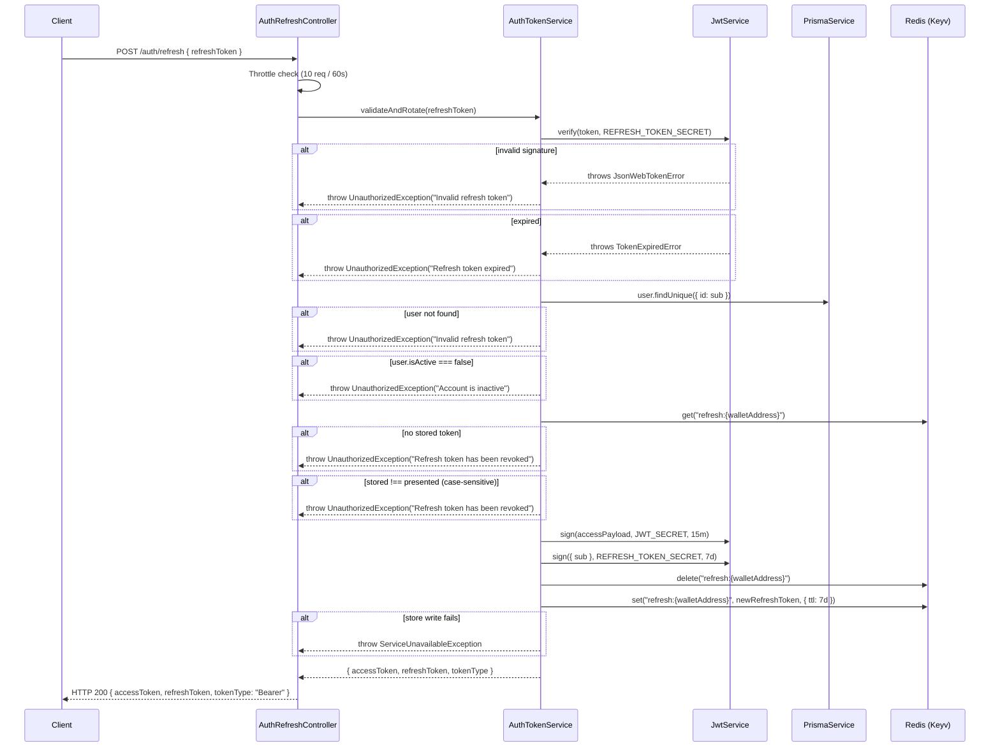

# Design Document: Token Refresh Endpoint

## Overview

This feature adds a `POST /auth/refresh` endpoint to the NestJS API that issues a new access token and a rotated refresh token in exchange for a valid, non-revoked refresh token. It closes the existing gap in the auth module where `users.service.ts` issues refresh tokens at login but does not persist them in Redis, making revocation and rotation impossible.

The design introduces two new artifacts — `AuthTokenService` and `AuthRefreshController` — and makes two targeted updates: (1) `users.service.ts` login() stores the issued refresh token in Redis, and (2) `auth.module.ts` registers the new pieces and imports `CacheModule`.

### Design Goals

- **Token rotation on every refresh**: each successful refresh invalidates the presented token and issues a new one, limiting the exposure window of any individual refresh token.
- **Unified revocation via Redis**: logout, rotation, and validation all operate against a single Redis key `refresh:{walletAddress}`, ensuring a consistent source of truth.
- **Minimal surface area**: no new infrastructure — the endpoint reuses JwtModule, `@nestjs/cache-manager` (Keyv), PrismaService, and the throttler already wired in the project.
- **Fail-closed on store errors**: if Redis is unavailable at any point in the flow, the endpoint returns 503 rather than issuing tokens or silently degrading.

---

## Architecture



The component that stores refresh tokens at login follows the same path in reverse — `users.service.ts` login() calls `Keyv.set("refresh:{walletAddress}", refreshToken, { ttl: 604800000 })` immediately after signing the refresh token.

---

## Components and Interfaces

### 1. `RefreshTokenDto` — `auth/dto/refresh-token.dto.ts`

Request body DTO. Validated by the global `ValidationPipe` via `class-validator`.

```typescript
import { IsString, IsNotEmpty } from 'class-validator';
import { ApiProperty } from '@nestjs/swagger';

export class RefreshTokenDto {
  @ApiProperty({ description: 'JWT refresh token issued at login or last refresh' })
  @IsString()
  @IsNotEmpty({ message: 'refreshToken is required' })
  refreshToken: string;
}
```

`IsNotEmpty` with a custom message ensures the 400 response message is `"refreshToken is required"` for missing, null, and empty-string values. The global `ValidationPipe` must be configured with `{ whitelist: true }` (already standard in NestJS apps) so extraneous fields are stripped.

---

### 2. `TokenPairDto` — response shape

Reuses the existing `LoginResponseDto` from `users/dto/login.dto.ts`:

```typescript
export class LoginResponseDto {
  accessToken: string;
  refreshToken: string;
  tokenType: 'Bearer';
}
```

`AuthRefreshController` returns this same type for consistency.

---

### 3. `AuthTokenService` — `auth/auth-token.service.ts`

Single public method: `validateAndRotate(refreshToken: string): Promise<LoginResponseDto>`

**Responsibilities:**
- Verify JWT signature and expiry using `JwtService.verify(token, { secret: REFRESH_TOKEN_SECRET })`
- Distinguish `TokenExpiredError` from other JWT errors to return different 401 messages
- Look up user by `sub` (UUID) in Prisma; check `isActive`
- Retrieve and compare the stored token from `Keyv` at `refresh:{walletAddress}`
- Sign a new access token (claims: `sub`, `walletAddress`, `role`; secret: `JWT_SECRET`; expiry: `15m`)
- Sign a new refresh token (claim: `sub`; secret: `REFRESH_TOKEN_SECRET`; expiry: `7d`)
- Rotate the Redis entry: delete old key, set new value with TTL 7d
- Wrap all Redis and Prisma errors in `ServiceUnavailableException`

**Constructor dependencies:**
```typescript
constructor(
  private readonly jwt: JwtService,
  private readonly config: ConfigService,
  private readonly prisma: PrismaService,
  @Inject(CACHE_MANAGER) private readonly cache: Keyv,
) {}
```

**Error handling table:**

| Condition | Exception thrown | HTTP status |
|-----------|-----------------|-------------|
| Body invalid / missing `refreshToken` | `ValidationPipe` → `BadRequestException` | 400 |
| JWT signature invalid | `UnauthorizedException("Invalid refresh token")` | 401 |
| JWT expired (`TokenExpiredError`) | `UnauthorizedException("Refresh token expired")` | 401 |
| `sub` claim missing or empty | `UnauthorizedException("Invalid refresh token")` | 401 |
| User not found in DB | `UnauthorizedException("Invalid refresh token")` | 401 |
| `user.isActive === false` | `UnauthorizedException("Account is inactive")` | 401 |
| No entry in Redis | `UnauthorizedException("Refresh token has been revoked")` | 401 |
| Stored token !== presented token | `UnauthorizedException("Refresh token has been revoked")` | 401 |
| Prisma throws | `ServiceUnavailableException("Service temporarily unavailable")` | 503 |
| Keyv throws | `ServiceUnavailableException("Service temporarily unavailable")` | 503 |
| Redis rotation write fails | `ServiceUnavailableException("Service temporarily unavailable")` | 503 |
| Rate limit exceeded | Throttler → `ThrottlerException` | 429 |

Note: the absent-key and token-mismatch paths intentionally return **identical** 401 messages to prevent token enumeration.

---

### 4. `AuthRefreshController` — `auth/auth-refresh.controller.ts`

```typescript
@ApiTags('auth')
@Controller('auth')
@Throttle({ default: { limit: 10, ttl: 60_000 } })
export class AuthRefreshController {
  constructor(private readonly tokenService: AuthTokenService) {}

  @Post('refresh')
  @HttpCode(HttpStatus.OK)
  @ApiOperation({ summary: 'Exchange a refresh token for a new token pair' })
  @ApiBody({ type: RefreshTokenDto })
  @ApiResponse({ status: 200, type: LoginResponseDto })
  @ApiResponse({ status: 400, description: 'refreshToken is required' })
  @ApiResponse({ status: 401, description: 'Invalid or revoked token' })
  @ApiResponse({ status: 429, description: 'Too many requests' })
  @ApiResponse({ status: 503, description: 'Service temporarily unavailable' })
  async refresh(@Body() dto: RefreshTokenDto): Promise<LoginResponseDto> {
    return this.tokenService.validateAndRotate(dto.refreshToken);
  }
}
```

The controller is intentionally thin: it delegates all logic to `AuthTokenService`. The `@HttpCode(HttpStatus.OK)` decorator is necessary because NestJS defaults `@Post` to 201.

---

### 5. `auth.module.ts` — updates

```typescript
@Module({
  imports: [
    JwtModule.registerAsync({ ... }),           // existing
    PrismaModule,                               // existing
    CacheModule.registerAsync({ ... }),         // ADD — same config as app.module or a shared module
  ],
  controllers: [
    AuthChallengeController,
    AuthVerifyController,
    AuthLogoutController,                       // existing
    AuthRefreshController,                      // ADD
  ],
  providers: [
    AuthTokenService,                           // ADD
  ],
  exports: [JwtModule, AuthTokenService],       // export AuthTokenService for potential reuse
})
export class AuthModule {}
```

If `CacheModule` is already imported at the app level as a global module, the import here is optional but explicit and harmless.

---

### 6. `users.service.ts` login() — patch

After the `refreshToken` is signed, persist it to Redis before returning:

```typescript
// After signing refreshToken:
const cacheKey = `refresh:${user.walletAddress}`;
const ttlMs = 7 * 24 * 60 * 60 * 1000; // 7 days in milliseconds
await this.cache.set(cacheKey, refreshToken, ttlMs);

return { accessToken, refreshToken, tokenType: 'Bearer' };
```

`UsersService` will require `@Inject(CACHE_MANAGER) private readonly cache: Keyv` added to its constructor, and `CacheModule` must be imported in `UsersModule`.

---

## Data Models

No Prisma schema changes are required. All token state lives in Redis under the key scheme `refresh:{walletAddress}`.

### Redis key structure

| Key | Value | TTL | Set by | Deleted by |
|-----|-------|-----|--------|------------|
| `refresh:{walletAddress}` | raw refresh JWT string | 7 days (604800s) | `login()` and `validateAndRotate()` | `logout()` and `validateAndRotate()` (old token) |

### JWT payload structures

**Access token** (signed with `JWT_SECRET`, expiry `15m`):
```json
{ "sub": "<uuid>", "walletAddress": "<stellar-public-key>", "role": "<UserRole>", "iat": ..., "exp": ... }
```

**Refresh token** (signed with `REFRESH_TOKEN_SECRET`, expiry `7d`):
```json
{ "sub": "<uuid>", "iat": ..., "exp": ... }
```

The refresh token payload is intentionally minimal — only `sub` — to avoid leaking role or wallet information if the token is compromised.

---

## Correctness Properties

*A property is a characteristic or behavior that should hold true across all valid executions of a system — essentially, a formal statement about what the system should do. Properties serve as the bridge between human-readable specifications and machine-verifiable correctness guarantees.*

### Property 1: Empty and whitespace refresh tokens are always rejected

*For any* string value of `refreshToken` that is empty, composed entirely of whitespace, null, or absent from the request body, the endpoint SHALL return HTTP 400 with the message `"refreshToken is required"`, and the token store SHALL remain unmodified.

**Validates: Requirements 1.2**

---

### Property 2: Payloads without a valid `sub` claim are always rejected

*For any* JWT payload where the `sub` claim is null, undefined, an empty string, or a whitespace-only string, the service SHALL return HTTP 401 with the message `"Invalid refresh token"`, regardless of whether the token's signature is otherwise valid.

**Validates: Requirements 1.7**

---

### Property 3: Token mismatch always produces a revoked response

*For any* pair of token values where the value stored in Redis at `refresh:{walletAddress}` is not strictly equal (case-sensitive) to the presented `refreshToken`, the endpoint SHALL return HTTP 401 with the message `"Refresh token has been revoked"`.

**Validates: Requirements 2.6, 6.4**

---

### Property 4: New access token always contains the correct claims

*For any* user record with a given `id`, `walletAddress`, and `role`, a successful refresh SHALL produce an access token whose decoded payload contains `sub` equal to `user.id`, `walletAddress` equal to `user.walletAddress`, and `role` equal to `user.role`.

**Validates: Requirements 3.1**

---

### Property 5: New refresh token always embeds the correct `sub`

*For any* user record, a successful refresh SHALL produce a new refresh token whose decoded payload contains `sub` equal to `user.id`, verifiable with `REFRESH_TOKEN_SECRET`.

**Validates: Requirements 3.2**

---

### Property 6: Token rotation replaces the stored token

*For any* successful refresh call, after the call completes the value stored at `refresh:{walletAddress}` SHALL equal the newly issued refresh token, not the token that was presented in the request. The old token SHALL no longer be accepted in a subsequent refresh call.

**Validates: Requirements 3.3**

---

### Property 7: Successful refresh response always contains all required fields

*For any* valid refresh request that passes all validation checks, the HTTP 200 response body SHALL contain `accessToken` (non-empty string), `refreshToken` (non-empty string), and `tokenType` equal to `"Bearer"`.

**Validates: Requirements 3.4**

---

### Property 8: Logout always prevents subsequent token reuse

*For any* user who has a valid refresh token in the store, after a logout (which deletes `refresh:{walletAddress}`), any subsequent `POST /auth/refresh` presenting that token SHALL return HTTP 401 with the message `"Refresh token has been revoked"`.

**Validates: Requirements 5.1**

---

### Property 9: Body-only acceptance — non-body token delivery is always rejected

*For any* refresh token value submitted via URL query parameter or any HTTP header other than `Content-Type`, the endpoint SHALL return HTTP 400 with the message `"refreshToken is required"`, equivalent to omitting the token from the body entirely.

**Validates: Requirements 6.1**

---

### Property 10: Error responses never leak the refresh token

*For any* error condition that causes the endpoint to return HTTP 400, 401, or 503, the response body and all response headers SHALL NOT contain the string value of the submitted `refreshToken`.

**Validates: Requirements 6.2**

---

### Property 11: Revocation response is identical for absent-key and mismatch

*For any* scenario where the Redis key `refresh:{walletAddress}` is absent AND for any scenario where the stored token differs from the presented token, the endpoint SHALL return HTTP 401 with the message `"Refresh token has been revoked"` — the two scenarios are indistinguishable in the response.

**Validates: Requirements 6.4** *(consolidates with Property 3; kept separate for explicitness of security intent)*

**Property reflection note:** Properties 3 and 11 overlap in coverage of Requirements 6.4. Property 3 addresses the token-mismatch case with emphasis on strict equality; Property 11 emphasizes the indistinguishability of absent-key vs mismatch for security. They are retained separately because they test different observable conditions (value inequality vs. key absence) that require distinct test setups, while both validating the same security requirement.

---

## Error Handling

### Global exception filter

The NestJS default exception filter maps all `HttpException` subclasses to their status codes. No custom filter is needed. `ServiceUnavailableException` (built-in) produces 503.

### TokenExpiredError disambiguation

`JwtService.verify` throws `TokenExpiredError` (a subclass of `JsonWebTokenError`) when the token is structurally valid but expired. `AuthTokenService` must catch this specifically before catching the parent `JsonWebTokenError`:

```typescript
try {
  payload = this.jwt.verify(refreshToken, { secret: refreshSecret });
} catch (err) {
  if (err instanceof TokenExpiredError) {
    throw new UnauthorizedException('Refresh token expired');
  }
  throw new UnauthorizedException('Invalid refresh token');
}
```

`TokenExpiredError` is exported from the `jsonwebtoken` package (available transitively through `@nestjs/jwt`).

### Redis / Prisma error wrapping

All calls to `this.cache.get()`, `this.cache.set()`, `this.cache.delete()`, and `this.prisma.user.findUnique()` are wrapped in try/catch blocks that rethrow as `ServiceUnavailableException("Service temporarily unavailable")`. This ensures the 503 contract is met even for unexpected error shapes.

### Rate-limit response

`@nestjs/throttler` v6 automatically injects a `Retry-After` header (in seconds) when a client exceeds the configured limit. No additional code is needed; the `@Throttle({ default: { limit: 10, ttl: 60_000 } })` decorator on the controller is sufficient.

### Validation errors

The global `ValidationPipe` (with `whitelist: true, forbidNonWhitelisted: false, transform: true`) produces a `BadRequestException` whose message array is formatted by the default exception filter. To return the exact message string `"refreshToken is required"` rather than the default array, the custom message on `@IsNotEmpty` is used. If the project's global pipe passes the raw message array, an `exceptionFactory` override on the pipe for the auth module can flatten it.

---

## Testing Strategy

### Unit tests (`*.spec.ts`)

Co-located with each new file:

**`auth-token.service.spec.ts`**
- Mock `JwtService`, `ConfigService`, `PrismaService`, `Keyv`
- Example tests: all error paths (invalid signature, expired, no user, inactive user, no Redis entry, Redis write failure)
- Example test: successful flow returns correct DTO structure
- Property tests: Properties 2, 3, 4, 5, 6, 7, 10, 11 (pure service logic, in-memory mocks)

**`auth-refresh.controller.spec.ts`**
- Mock `AuthTokenService`
- Example tests: delegates to service, correct HTTP status codes, body shape
- Property test: Properties 1, 9 (input validation via `ValidationPipe`)

**`users.service.spec.ts` (update)**
- Add test asserting that `login()` calls `cache.set("refresh:{walletAddress}", refreshToken, ttlMs)` with the correct arguments

### Property-based testing

Library: **[`fast-check`](https://github.com/dubzzz/fast-check)** — mature, TypeScript-native, integrates with Jest/Vitest.

Minimum **100 runs per property** (fast-check default is 100; set explicitly with `{ numRuns: 100 }`).

Tag format for each property test:
```
// Feature: token-refresh-endpoint, Property N: <property text>
```

**Property test examples:**

```typescript
// Feature: token-refresh-endpoint, Property 1: Empty and whitespace refresh tokens are always rejected
it('rejects any empty or whitespace refreshToken', async () => {
  await fc.assert(
    fc.asyncProperty(
      fc.oneof(fc.constant(''), fc.string({ minLength: 1 }).map(s => s.replace(/\S/g, ' '))),
      async (token) => {
        // submit token as body, assert 400 with "refreshToken is required"
      },
    ),
    { numRuns: 100 },
  );
});

// Feature: token-refresh-endpoint, Property 3: Token mismatch always produces a revoked response
it('returns 401 revoked for any non-matching stored/presented pair', async () => {
  await fc.assert(
    fc.asyncProperty(
      fc.string({ minLength: 1 }),
      fc.string({ minLength: 1 }).filter(s => s !== storedToken),
      async (stored, presented) => {
        mockCache.get.mockResolvedValue(stored);
        // submit presented, assert 401 "Refresh token has been revoked"
      },
    ),
    { numRuns: 100 },
  );
});
```

### Integration tests

- Fire 11 rapid `POST /auth/refresh` requests to the running server; assert the 11th returns 429 with `Retry-After` header (Requirement 4.2)
- Full login → refresh → refresh chain to verify token rotation works end-to-end with a real Redis instance
- Login → logout → refresh to verify revocation end-to-end (Requirement 5.1)

### Test coverage targets

| Layer | Target |
|-------|--------|
| `AuthTokenService` — branch coverage | ≥ 95% |
| `AuthRefreshController` | ≥ 90% |
| `users.service.ts` login() Redis path | 100% (new lines) |
| Property tests | 100% of correctness properties have at least one property-based test |
